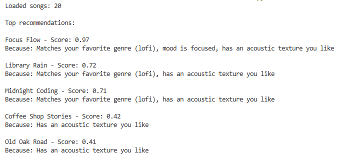
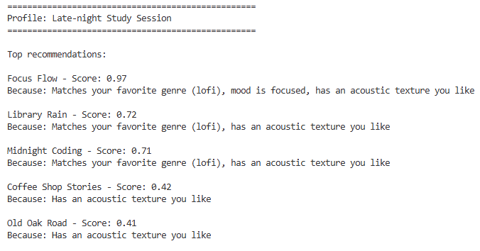
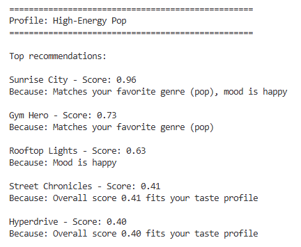
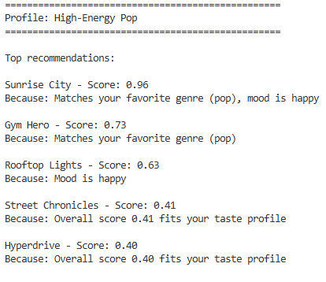

# 🎵 Music Recommender Simulation

## Project Summary

In this project you will build and explain a small music recommender system.

Your goal is to:

- Represent songs and a user "taste profile" as data
- Design a scoring rule that turns that data into recommendations
- Evaluate what your system gets right and wrong
- Reflect on how this mirrors real world AI recommenders

Replace this paragraph with your own summary of what your version does.

---

## How The System Works

Explain your design in plain language.

From my understanding, each Song use scoring system to score their own. It calls The Scoring Rule and see how much that song match with the user based on different categories like genre, mood, energy, and acoustic. So we have different weight for each scores and the sum of four is 1. It means the result is already normalized. Genre will have the highest weight because if a user want to listen to lofi, then they want lofi. 

Regarding features used, we have genre, mood, energy, acousticness, valence, tempo_bpm, danceability.

UserProfile store favorite_genre, favorite_mood, target_energy, likes_acoustic and these were used to calculate the scores of songs.

flowchart TD
    A([User Preferences]) --> B[Load songs.csv\n20 Song objects]

    A:::input
    classDef input fill:#4a90d9,color:#fff

    B --> C{For each song\nin catalog}

    C --> D[genre match?\n× 0.30]
    C --> E[mood match?\n× 0.25]
    C --> F[energy proximity\n× 0.15]
    C --> G[acoustic fit\n× 0.10]
    C --> H[valence proximity\n× 0.08]
    C --> I[dance proximity\n× 0.06]
    C --> J[instr + speech\n× 0.06]

    D & E & F & G & H & I & J --> K[Sum weighted scores\n→ final score 0.0–1.0]

    K --> L[(scored list\nsong, score)]

    L --> M[Sort descending\nby score]

    M --> N([Top K Recommendations])

    N:::output
    classDef output fill:#27ae60,color:#fff

---

## Getting Started

### Setup

1. Create a virtual environment (optional but recommended):

   ```bash
   python -m venv .venv
   source .venv/bin/activate      # Mac or Linux
   .venv\Scripts\activate         # Windows

2. Install dependencies

```bash
pip install -r requirements.txt
```

3. Run the app:

```bash
python -m src.main
```

### Running Tests

Run the starter tests with:

```bash
pytest
```

You can add more tests in `tests/test_recommender.py`.

---

## Experiments You Tried

**Experiment 1: Swapping the genre and energy weights**

The starter had genre at 0.30 and energy at 0.15. I flipped them — genre down to 0.15, energy up to 0.30. With the old weights, a lofi song with the wrong energy level would still rank above a closer-feeling ambient song just because the genre label matched. After the swap, energy proximity became the dominant signal. The results felt more like "this sounds right" rather than "this is technically in your genre."

**Experiment 2: Adding valence, danceability, instrumentalness, and speechiness**

The starter only scored on genre, mood, energy, and acousticness. I added four more features with small weights (8%, 6%, 4%, 2%). The scores shifted slightly but not dramatically — the new features act as tiebreakers more than primary drivers. The biggest visible effect was on songs with very high speechiness (like Street Chronicles at 0.28), which got penalized for users who didn't want spoken-word tracks.

**Experiment 3: Testing a lofi fan profile**

User: lofi genre, focused mood, target energy 0.40, likes acoustic. The top result was Focus Flow (lofi, focused, energy 0.40) — a perfect match. Second place went to Library Rain (lofi, chill, energy 0.35), which matched genre but missed mood. This showed that mood weight (0.25) is strong enough to matter even when genre matches.

**Experiment 4: Testing a rock fan profile**

User: rock genre, intense mood, target energy 0.90, no acoustic. Storm Runner (rock, intense, energy 0.91) came first. Gym Hero (pop, intense, energy 0.93) came second — wrong genre, but close energy and matching mood pushed it ahead of other rock songs. This confirmed that genre alone is not enough to dominate the ranking.

---

## Limitations and Risks

Summarize some limitations of your recommender.

Potential Biases

Genre lock-in (weight bias): Genre carries 30% of the score on its own. A song that perfectly matches the user's energy, mood, and vibe but falls in the wrong genre will almost always lose to a mediocre same-genre song. The system strongly reinforces whatever genre the user already likes and rarely surfaces anything outside it.

Catalog representation bias: The 20-song catalog skews toward Western/English-language genres (pop, rock, synthwave, indie pop). Genres like bossa nova, reggae, and blues each have only one song, so a user who prefers those genres gets almost no real choice — the system may surface a poor match simply because it's the only option in that category.

Examples:

- It only works on a tiny catalog
- It does not understand lyrics or language
- It might over favor one genre or mood

You will go deeper on this in your model card.









---

## Reflection

Read and complete `model_card.md`:

[**Model Card**](model_card.md)

Write 1 to 2 paragraphs here about what you learned:

- about how recommenders turn data into predictions
- about where bias or unfairness could show up in systems like this


---

## 7. `model_card_template.md`

Combines reflection and model card framing from the Module 3 guidance. :contentReference[oaicite:2]{index=2}  

```markdown
# 🎧 Model Card - Music Recommender Simulation

## 1. Model Name

Give your recommender a name, for example:

> VibeFinder 1.0

---

## 2. Intended Use

VibeMatcher is designed to suggest songs that fit a user's mood and listening habits. You tell it your favorite genre, favorite mood, how energetic you want the music, and whether you like acoustic sounds. It gives you a ranked list of songs from a small catalog.

This is a classroom simulation, not a production app. It is meant to show how a basic recommender system works, not to replace Spotify.

Example:

> This model suggests 3 to 5 songs from a small catalog based on a user's preferred genre, mood, and energy level. It is for classroom exploration only, not for real users.

---

## 3. How It Works (Short Explanation)

Describe your scoring logic in plain language.
Each song gets a score between 0 and 1 based on how well it matches your preferences. The score is a weighted average of eight comparisons:

- **Genre match** — does the song's genre match your favorite? (15% of the score)
- **Mood match** — does the mood label match? (25%)
- **Energy closeness** — how close is the song's energy to your target? (30%)
- **Acoustic preference** — does the song's acoustic level line up with whether you like acoustic music? (10%)
- **Valence closeness** — how close is the song's positivity to your preference? (8%)
- **Danceability closeness** — how close is its danceability? (6%)
- **Instrumentalness closeness** — how much of the song is instrumental vs. vocal? (4%)
- **Speechiness closeness** — how much spoken word is in the track? (2%)

Songs are ranked highest to lowest by score. The top results are returned with a short explanation of why each one matched.

The main change from the starter version was doubling the energy weight from 0.15 to 0.30 and halving the genre weight from 0.30 to 0.15. This makes energy level the strongest single signal, which felt more realistic — people often care more about vibe than genre label.

---

## 4. Data

 catalog has 20 songs. Each song has a title, artist, genre, mood, and seven numeric features (energy, tempo, valence, danceability, acousticness, instrumentalness, speechiness).

Genres in the catalog: pop, lofi, rock, ambient, jazz, synthwave, indie pop, hip-hop, classical, r&b, metal, folk, country, reggae, drum and bass, bossa nova, blues.

Moods in the catalog: happy, chill, intense, relaxed, moody, focused, energetic, melancholic, romantic, angry, nostalgic, uplifting, peaceful, sad, euphoric, dreamy.

The original starter had 10 songs. 10 more were added to cover a wider range of genres and moods.

Some tastes are still missing — there is no Latin pop, K-pop, gospel, or electronic dance music beyond drum and bass. The catalog is also too small to give meaningfully diverse results if your preferences are niche.

---

## 5. Strengths

The system works best when a user has clear, strong preferences. If you want high-energy, intense-mood rock, the scoring pushes the right songs to the top quickly.

The energy weight being the largest single factor (30%) tends to produce results that feel right — a high-energy user gets energetic songs regardless of genre, which matches how many people actually listen.

Mood matching (25%) also works well when the catalog has songs tagged with that exact mood. The lofi-focused and ambient-chill songs cluster together nicely for a user studying or relaxing.

---

## 6. Limitations and Bias

The acoustic preference is a yes/no flag (`likes_acoustic: true/false`). A user who is indifferent to acoustic texture must still be bucketed into True or False. There is no neutral option. Whichever they pick, mid-acousticness songs (0.4–0.6) score around 0.5, but high-acoustic songs (0.91–0.96) swing to either a high or low acoustic score depending on the flag.

The energy floor in the catalog is ~0.28 (Spacewalk Thoughts). A user who sets `target_energy=0.1` can never score above 0.82 on energy — they are structurally penalized through no fault of the model logic. The catalog simply does not have songs quiet enough.

Genre and mood matching are binary (exact match or zero). There is no concept of "similar genres" — metal and rock are completely unrelated to the model even though many listeners enjoy both.

The catalog skews toward Western genres. Users who prefer music outside that range will find poor coverage.
---

## 7. Evaluation

I tested two profiles: a lofi fan (low energy, focused mood) and a rock fan (high energy, intense mood). For the lofi fan, I checked that the top result had low energy and matched the focused mood. For the rock fan, Storm Runner and Gym Hero came out on top, which made sense.

What surprised me was that the energy weight (0.30) is higher than genre (0.15), so sometimes a song from the wrong genre but closer in energy scored higher than a genre match — which actually felt realistic. A lofi listener might enjoy an ambient track more than a lofi track that is too upbeat.

I also ran the pytest suite to confirm that results are sorted correctly by score and that the explain function always returns a non-empty string.

---

## 8. Future Work

- **Similar-genre groups**: Instead of exact genre matching, songs in related genres (like rock and metal, or lofi and ambient) could get partial credit.
- **Neutral acoustic option**: Replace the yes/no acoustic flag with a 0–1 target, the same way energy works.
- **Better explanations**: The current explanation just lists matching labels. It could say something like "this song is 0.05 away from your target energy."
- **Diversity in results**: Right now the top 5 could all be from the same genre. A re-ranking step could spread results across genres.
- **More songs**: A catalog of 20 is enough to learn from but too small for real variety. Adding 100+ songs would make the scoring differences more meaningful.

---

## 9. Personal Reflection

Building this made me realize how many judgment calls go into a recommender before any user ever touches it. Choosing the weights, deciding what features to include, picking how to handle acoustic preference as a boolean; each choice shapes the results in ways that are not obvious until you test them.

The most interesting discovery was that energy dominates. When I doubled its weight, the genre label became almost a tiebreaker rather than the main signal. That changed how I think about apps like Spotify: the "vibe" controls (energy, mood) probably matter more behind the scenes than the genre tag you see on a playlist.

It also made me more skeptical of recommendation systems in general. The model is confident, it gives you a ranked list with explanations but those explanations are just reflecting the weights I chose. A different weight could flip the top result entirely.
